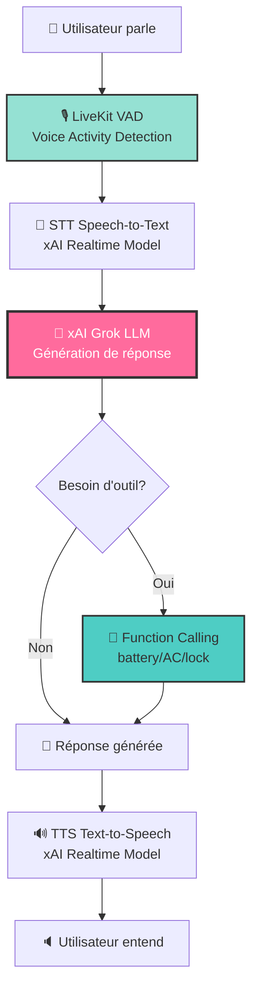

# Kemet Assistant - Documentation Technique

## 📋 Vue d'ensemble

**Kemet Assistant** est un assistant vocal IA pour véhicules électriques avec une personnalité décontractée et drôle. Il utilise l'API xAI (Grok) pour l'intelligence artificielle et LiveKit pour la communication vocale en temps réel.

### Caractéristiques principales

- 🎤 **Interaction vocale bidirectionnelle** : Parlez naturellement, recevez des réponses audio
- 🛠️ **Actions intelligentes** : Contrôle du véhicule (batterie, climatisation, verrouillage)
- ⚡ **Interruptible** : Possibilité de couper l'assistant en pleine phrase
- 😎 **Personnalité unique** : Ton décontracté, humoristique avec des blagues
- 🔧 **Extensible** : Architecture modulaire pour ajouter de nouvelles fonctionnalités

---

## 🏗️ Architecture

### Pipeline de traitement vocal



### Composants principaux

| Composant | Technologie | Rôle |
|-----------|-------------|------|
| **VAD** | Silero | Détection de l'activité vocale |
| **STT** | xAI Realtime | Conversion parole → texte |
| **LLM** | xAI Grok | Intelligence artificielle |
| **TTS** | xAI Realtime | Conversion texte → parole |
| **Database** | Supabase | Stockage des données véhicule |
| **WebRTC** | LiveKit | Communication temps réel |

---

## 📁 Structure des fichiers

### Fichiers modifiés

#### [`assitant.py`](file:///home/prototype/SoftRide/assitant.py)

**Rôle** : Point d'entrée principal de l'assistant vocal

**Fonctionnalités implémentées** :
- Configuration de la personnalité "chill et drôle"
- Intégration xAI Realtime Model
- Gestion SSL pour réseaux d'entreprise
- Outils de contrôle véhicule (3 fonctions)

**Fonctions disponibles** :
```python
@llm.function_tool
async def get_battery_level() -> str
    """Récupère le niveau de batterie du véhicule"""

@llm.function_tool
async def set_ac_state(on: bool) -> str
    """Allume ou éteint la climatisation"""

@llm.function_tool
async def is_car_locked() -> str
    """Vérifie si le véhicule est verrouillé"""
```

#### [`db.py`](file:///home/prototype/SoftRide/db.py)

**Rôle** : Wrapper pour la base de données Supabase

**Classe principale** :
```python
class KemetDB:
    def get_vehicle_status(vehicle_id: str) -> dict
    def update_vehicle_action(action: str, value: any) -> bool
```

**Mode de secours** : Si Supabase n'est pas configuré, utilise des données mockées

### Nouveaux fichiers créés

#### [`requirements.txt`](file:///home/prototype/SoftRide/requirements.txt)
Dépendances Python nécessaires :
```
livekit-agents>=0.8.0         # Framework agents LiveKit
livekit-plugins-xai           # Plugin xAI pour LiveKit
livekit-plugins-silero        # Détection d'activité vocale
python-dotenv>=1.0.0          # Gestion variables d'environnement
supabase>=2.0.0               # Client Supabase
aiohttp>=3.9.0                # Client HTTP asynchrone
```

#### [`docs/kemet-assistant-setup.md`](file:///home/prototype/SoftRide/docs/kemet-assistant-setup.md)
Guide de démarrage rapide en anglais

---

## ⚙️ Configuration

### Variables d'environnement

Créez un fichier `.env` à la racine du projet avec les variables suivantes :

```bash
# LiveKit (obligatoire)
# Obtenez vos clés sur https://cloud.livekit.io
LIVEKIT_URL=wss://[VOTRE-PROJET].livekit.cloud
LIVEKIT_API_KEY=[VOTRE-API-KEY]
LIVEKIT_API_SECRET=[VOTRE-API-SECRET]

# xAI (obligatoire)
# Obtenez votre clé sur https://console.x.ai
XAI_API_KEY=[VOTRE-XAI-API-KEY]

# Supabase (optionnel, pour données véhicule)
SUPABASE_URL=https://[VOTRE-PROJET].supabase.co
SUPABASE_KEY=[VOTRE-ANON-KEY]
```

> [!TIP]
> Vous avez mentionné avoir déjà une clé xAI API. Il vous suffit de créer un compte LiveKit gratuit pour tester.

---

## 🚀 Installation et utilisation

### 1. Installation des dépendances

```bash
pip install -r requirements.txt
```

### 2. Configuration

```bash
# Copier le template d'environnement
cp .env.example .env

# Éditer .env avec vos clés
nano .env
```

### 3. Lancement de l'assistant

```bash
python assitant.py dev
```

**Sortie attendue** :
```
INFO:grok-assistant:Starting job for room: ...
INFO:grok-assistant:Connected to Supabase.
INFO:grok-assistant:Connecting agent to room...
INFO:grok-assistant:Assistant is running. Press Ctrl+C to stop.
```

### 4. Connexion pour tester

#### Option A : LiveKit Agents Playground (Recommandé)

1. Ouvrir [agents-playground.livekit.io](https://agents-playground.livekit.io/)
2. Entrer vos credentials LiveKit
3. Cliquer sur "Connect"
4. Autoriser le micro dans votre navigateur
5. Commencer à parler !

#### Option B : Frontend personnalisé

Intégrer le SDK LiveKit dans votre application frontend (`apps/my-kemet` ou autre).

---

## 💬 Exemples d'interaction

### Commandes vocales disponibles

| Ce que vous dites | Réponse de Kemet |
|-------------------|------------------|
| "Quel est le niveau de ma batterie ?" | "La batterie est à 78%. T'as encore de quoi rouler, relax !" |
| "Allume la clim" | "Clim activée ! Ça va être frais par ici 😎" |
| "Est-ce que ma voiture est verrouillée ?" | "Yep, ta caisse est bien lockée. Personne rentre là-dedans !" |
| "Raconte-moi une blague" | "Pourquoi les véhicules électriques sont-ils mauvais en mensonge ? Parce qu'ils sont toujours **chargés** à bloc ! 😂" |

### Personnalité de Kemet

Kemet a été configuré pour être :

- **Décontracté** : Parle comme un pote, pas comme un robot
- **Drôle** : Fait des blagues et des jeux de mots
- **Légèrement roasteur** : Peut taquiner si vous posez des questions évidentes
- **Toujours utile** : Même en plaisantant, il répond à vos demandes

**Extrait du prompt système** :
```python
"You are Kemet, a chill and witty AI assistant for electric vehicles. "
"Your vibe is relaxed, funny, and you love dropping jokes to keep things light. "
"Roast a little if the user asks silly questions, but always stay helpful. "
"Think of yourself as that cool friend who knows cars AND comedy."
```

---

## 🔧 Dépannage

### Erreur SSL Certificate

**Problème** : Erreur SSL lors de la connexion à xAI

**Solution** : Le code inclut déjà un workaround pour les réseaux d'entreprise (Fortinet, etc.)
```python
ssl_context = ssl.create_default_context()
ssl_context.check_hostname = False
ssl_context.verify_mode = ssl.CERT_NONE
```

### Pas de sortie vocale

**Vérifications** :
1. Autorisations micro/haut-parleurs dans le navigateur
2. LiveKit URL correcte dans `.env`
3. API keys valides

### Outils non fonctionnels

**Vérifications** :
1. Credentials Supabase correctes
2. Table `vehicles` créée dans Supabase
3. Données de test insérées

**Mode de secours** : Si Supabase échoue, données mockées utilisées automatiquement

---

## 📊 État d'avancement du roadmap

| Étape | Fonctionnalité | Status | Notes |
|-------|----------------|--------|-------|
| **1** | IA vocale basique | ✅ **Terminé** | MVP fonctionnel |
| **2** | Actions IA | ✅ **Terminé** | 3 outils implémentés |
| **3** | Interruptibilité | ✅ **Terminé** | `allow_interruptions=True` |
| **4** | Adaptation du ton vocal | 🔜 **À venir** | Le "moat" principal |
| **5** | Conscience contextuelle | 🔜 **Futur** | Mémoire utilisateur |

### Prochaines étapes

#### Phase 4 : Adaptation du ton vocal (Le différenciateur clé)

**Objectif** : Adapter le ton de Kemet selon l'énergie de l'utilisateur

**Technologies à explorer** :
- **ElevenLabs** : Voice cloning + modulation en temps réel
- **Analyse de sentiment** : Détecter l'humeur de l'utilisateur
- **Paramètres TTS dynamiques** : Ajuster la vitesse, le pitch, l'énergie

**Implémentation suggérée** :
```python
# Analyser le ton de l'utilisateur
user_tone = analyze_voice_characteristics(audio_input)

# Ajuster les paramètres TTS
tts_params = {
    "speed": match_speed(user_tone.speaking_rate),
    "pitch": match_pitch(user_tone.pitch),
    "energy": match_energy(user_tone.volume)
}

# Générer la réponse avec le ton adapté
response = tts.generate(text, **tts_params)
```

#### Phase 5 : Conscience contextuelle

**Objectif** : Kemet se souvient de vous et personnalise les réponses

**Fonctionnalités à ajouter** :
- Historique des conversations dans Supabase
- Profil utilisateur (préférences, habitudes)
- RAG (Retrieval-Augmented Generation) pour mémoire long terme
- Suggestions proactives basées sur l'historique

---

## 🧪 Tests

### Tests automatiques
Aucun test automatisé pour l'instant (difficile pour les interactions vocales)

### Tests manuels

#### ✅ Tests effectués

- [x] Validation syntaxe Python (`assitant.py`, `db.py`)
- [x] Vérification des dépendances
- [x] Configuration des variables d'environnement

#### 🧪 Tests requis (par vous)

1. **Test de connexion**
   ```bash
   python assitant.py dev
   ```
   ✅ L'agent se connecte sans erreur

2. **Test vocal basique**
   - Dire : "Bonjour"
   - ✅ Kemet répond avec sa personnalité

3. **Test des outils**
   - Dire : "Quel est le niveau de ma batterie ?"
   - ✅ Kemet appelle `get_battery_level()` et répond

4. **Test d'interruptibilité**
   - Laisser Kemet parler
   - Commencer à parler pendant sa réponse
   - ✅ Kemet s'arrête et vous écoute

5. **Test de personnalité**
   - Poser une question bête
   - ✅ Kemet vous roast gentiment tout en répondant

---

## 📚 Ressources

### Documentation officielle

- [LiveKit Agents](https://docs.livekit.io/agents/) - Framework pour agents vocaux
- [xAI API](https://docs.x.ai/) - Documentation xAI/Grok
- [Supabase Python](https://supabase.com/docs/reference/python/introduction) - Client Supabase

### Tutoriels utiles

- [Building Voice Agents with LiveKit](https://blog.livekit.io/building-voice-agents/)
- [xAI Function Calling](https://docs.x.ai/docs/guides/function-calling)

### Communauté

- [LiveKit Discord](https://livekit.io/discord)
- [xAI Community Forum](https://community.x.ai/)

---

## 🤝 Contribution

### Ajouter un nouvel outil

```python
@llm.function_tool
async def nouvelle_fonction(
    param: Annotated[type, "Description du paramètre"]
) -> str:
    """Description de ce que fait l'outil"""
    logger.info(f"TOOL CALL: nouvelle_fonction(param={param})")
    
    try:
        # Votre logique ici
        result = db.some_operation(param)
        return f"Résultat : {result}"
    except Exception as e:
        logger.error(f"TOOL ERROR: {e}")
        return "Erreur lors de l'opération"

# Ajouter à la liste des outils de l'agent
agent = Agent(
    ...
    tools=[get_battery_level, set_ac_state, is_car_locked, nouvelle_fonction],
)
```

### Modifier la personnalité

Éditez les prompts dans [`assitant.py`](file:///home/prototype/SoftRide/assitant.py) :

```python
# Ligne 88-96 : ChatContext initial
initial_chat_ctx.add_message(
    role="system",
    content="Votre nouveau prompt système..."
)

# Ligne 117-121 : Instructions de l'agent
agent = Agent(
    instructions="Vos nouvelles instructions...",
    ...
)
```

---

## ⚠️ Limitations actuelles

1. **Pas d'adaptation de ton** : Voix fixe (Phase 4 non implémentée)
2. **Pas de mémoire long terme** : Ne se souvient pas des conversations précédentes
3. **Outils limités** : Seulement 3 fonctions (batterie, AC, verrou)
4. **Données véhicule mockées** : Si Supabase non configuré
5. **Langue principale** : Optimisé pour l'anglais (peut répondre en français mais moins naturel)

---

## 📝 Changelog

### Version 1.0.0 - MVP (2026-01-14)

#### ✨ Nouvelles fonctionnalités
- Assistant vocal bidirectionnel avec xAI
- Personnalité chill et drôle
- 3 outils de contrôle véhicule
- Interruptibilité native
- Support SSL pour réseaux d'entreprise

#### 📄 Fichiers créés
- `requirements.txt` - Dépendances Python
- `docs/kemet-assistant-setup.md` - Guide de démarrage
- `docs/kemet-assistant-doc.md` - Documentation complète (ce fichier)

#### 🔧 Fichiers modifiés
- `assitant.py` - Personnalité et configuration
- `.env.example` - Variables LiveKit et xAI

---

## 📞 Support

Pour toute question ou problème :

1. Vérifier cette documentation
2. Consulter les [issues GitHub](https://github.com/Meric-BG/SoftRide/issues)
3. Rejoindre le Discord LiveKit pour support technique

---

**Kemet Assistant** - *L'assistant vocal qui rend la conduite électrique plus cool* 😎🚗⚡
